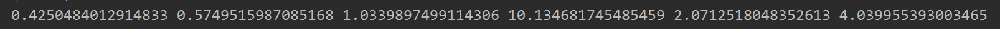
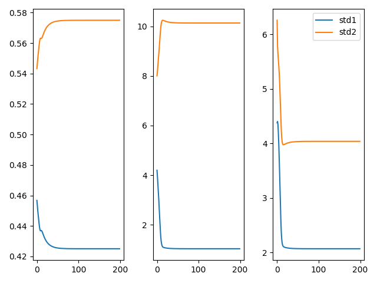

## EM 算法

### 一、极大似然估计

极大似然估计是一种已知抽样结果，去求分布参数的一种方法。其包含的思想就是：既然我得到的是这种抽样结果，那么我有理由相信这种结果出现的可能性很大，所以通过最大化这种可能性求出待定的参数。极大似然估计的前提是总体的分布类型是已知的。似然指的就是根据抽样情况去估计参数值。

我们来举一个例子，假设现在大学生的身高满足正态分布$N(\mu,\sigma^2)$,我们随机抓了$M$个同学进行抽样调查。抽到身高A的概率是$p(x_a|\theta)$ (其中$\theta$是未知的参数),抽到身高B的概率是$p(x_b|\theta)$ ，它们之间相互独立，那么抽取到这样一组身高样本的概率为：
$$
L(\theta) = L(x_1,x_2,...,x_M;\theta) = \Pi_{i=1}^np(x_i|\theta),\theta \in \Theta \tag{1}
$$
$L(\theta)$即为似然函数。为了求导的方便，我们对(1)式去对数得到对数似然函数：
$$
H(\theta) = lnL(\theta) = ln\Pi_{i=1}^np(x_i|\theta)=\sum_{i=1}^nlnp(x_i|\theta) \tag{2}
$$
因为$H(\theta)$和$L(\theta)$单调性相同，对$H(\theta)$即可求出极大似然估计下的$\theta$值。

### 二、引出EM算法

EM算法用于含有隐变量(hidden variable)的概率模型参数的极大似然估计(MLP)或者极大后验概率估计（MAP)。

我们来改一下上面的例子，现实情况下男女的身高是符合不同的分布的，假设男同学符合分布$N(\mu_1,\sigma_1^2)$,女同学们符合分布$N(\mu_2,\sigma_2^2)$。现在我们得到了M个抽样，但是我们并不知道某个数据是男同学的身高还是女同学的身高。当然这时候有同学可能会提出将男女的概率作为另一个参数然后进行极大似然，下面我们写出这种思路下的似然函数
$$
L(\theta_1,\theta_2,q_i) = \Pi_{i=1}^n[q_ip(x_i|\theta_1)+(1-q_i)p(x_i|\theta_2)] \tag{3}
$$
上式中，$\theta_1 = [\mu_1,\theta_1]^T,\theta_2 = [\mu_2,\theta_2]^T$,$q_i$为抽取身高是男同学身高的概率。这里$q_i$可能满足一个分布，但是如论怎么样这个似然函数求导还是比较困难的。下面我们就来看看EM算法。

### 三、介绍EM算法

EM算法是通过迭代的方式进行参数估计，其由两步组成：E步：求期望(expectation)；M步：求极大(maximization)。所以这一算法称为期望极大算法(expectation maximization algorithm),简称EM算法。

> EM算法：
>
> 输入：观测变量数据Y,隐变量数据Z,联合分布$P(Y,Z|\theta)$,条件分布$P(Z|Y,\theta)$;
>
> 输出：模型的参数$\theta$
>
> (1)选择参数的初始值$\theta^{(0)}$,开始迭代
>
> (2)E步：记$\theta^{(i)}$为第i次迭代参数$\theta$的估计值，在第i+1次迭代的E步计算(稍后推导)：
> $$
> \begin{align}
> Q(\theta,\theta^{(i)})&=E_z(logP(Y,Z|\theta)|Y,\theta^{(i)})\\
> &=\sum_ZlogP(Y,Z|\theta)P(Z|Y,\theta^{(i)})
> \end{align}
> $$
> (3)M步：求使$Q(\theta,\theta^{(i)})$极大化的$\theta$,确定第i+1次迭代后参数的估计值$\theta^{(i+1)}$
> $$
> \theta^{(i+1)} = \mathop{\arg\max}_\theta Q(\theta,\theta^{(i)})
> $$
> (4)重复（2）-（3）步，直到收敛。

**定义（Q函数）：**完全数据的对数似然函数$logP(Y,Z|\theta)$关于在给定观测数据$Y$和当前参数$\theta^{(i)}$下对未观测数据$Z$的条件概率分布$P(Z|Y,\theta^{(i)})$的期望称为$Q$函数，即：
$$
Q(\theta,\theta^{(i)})=E_z(logP(Y,Z|\theta)|Y,\theta^{(i)}) \tag{4}
$$
**说明**：

(1) $\theta$的初值可以任意选择，但是需注意EM算法对初值的选择是敏感的

(2) $\Q(\theta,\theta^{(i)})$中$\theta$是需要极大的变量，$\theta^{(i)}$表示当前的估计值

(3) 最后的停止条件，一般是对较少的正数$\varepsilon_1,\varepsilon_2$,若满足
$$
\|\theta^{(i+1)}-\theta^{(i)}\|<\varepsilon_1 或者 \|Q(\theta^{i+1},\theta^i)-Q(\theta^i,\theta^i)\|<\varepsilon_2
$$

### 四、EM算法的导出

上面叙述了EM算法，为什么EM算法能近似实现对观测数据的极大似然估计？下面通过近似求解观测数据的对数似然函数的极大化问题来导出EM算法。

我们面对含有隐变量的概率模型，目标是极大化观测数据$Y$关于参数$\theta$的对数似然，即最大化：
$$
\begin{align}
L(\theta)=logP(Y|\theta)&=log\sum_ZP(Y,Z|\theta)\\
&=log(\sum_ZP(Y|Z,\theta)P(Z|\theta)) \tag{5}
\end{align}
$$
(5)式中极大化的困难在上面已经提到了，就是其中包含求和对数，并且$P(Z|\theta)$很难得到 。事实上EM算法式采用迭代的方式近似求解，在迭代的过程中我们希望$L(\theta) $能够增加，即$L(\theta)\gt L(\theta^{(i)})$并逐步达到极大值。我们计算两者的差：
$$
L(\theta)-L(\theta^{(i)})=log(\sum_ZP(Y|Z,\theta)P(Z|\theta))-logP(Y|\theta^{(i)}) \tag{6}
$$
因为log函数是上凸函数(我们不直接说是凸函数，因为目前国内外对凸函数的定义有差异)，根据Jensen不等式$f(\sum_i\lambda_ix_i)\ge\sum_i\lambda_if(x_i)$有：
$$
\begin{align}
L(\theta)-L(\theta^{(i)}) &= log(\sum_ZP(Z|Y,\theta^{(i)})\frac{P(Y|Z,\theta)P(Z|\theta)}{P(Z|Y,\theta^{(i)})})-logP(Y|\theta^{(i)})\\
&\ge\sum_zP(Z|Y,\theta^{(i)})log\frac{P(Y|Z,\theta)P(Z|\theta)}{P(Z|Y,\theta^{(i)})}-logP(Y|\theta^{(i)})\\
&=\sum_zP(Z|Y,\theta^{(i)})log\frac{P(Y|Z,\theta)P(Z|\theta)}{P(Z|Y,\theta^{(i)})}-\sum_zP(Z|Y,\theta^{(i)})logP(Y|\theta^{(i)})\\
&=\sum_zP(Z|Y,\theta^{(i)})log\frac{P(Y|Z,\theta)P(Z|\theta)}{P(Z|Y,\theta^{(i)})logP(Y|\theta^{(i)})}
\end{align}
$$

令：
$$
B(\theta,\theta^{(i)}) = L(\theta^{(i)})+\sum_zP(Z|Y,\theta^{(i)})log\frac{P(Y|Z,\theta)P(Z|\theta)}{P(Z|Y,\theta^{(i)})logP(Y|\theta^{(i)})} \tag{7}
$$
则:
$$
L(\theta)\ge B(\theta,\theta^{(i)})
$$
所以$B(\theta,\theta^{(i)})$$是L(\theta)$ 的一个下界。

并且：$L(\theta^{(i)}) = B(\theta^{(i)},\theta^{(i)})$ 

因此任何可以是$B(\theta,\theta^{(i)})$增大的$\theta$也可以使$L(\theta)$增大。为了使得$L(\theta)$能够有尽可能大的增长，选择$\theta^{(i+1)}$使$B(\theta,\theta^{(i)})$达到极大即：
$$
\theta^{(i+1)} = \mathop{\arg\max}_\theta B(\theta,\theta^{(i)}) \tag{8}
$$
下面对这个式子进行推导(推导过程中去掉与$\theta$无关的部分)：
$$
\begin{align}
\theta^{(i+1)}&=\mathop{\arg\max}_\theta (L(\theta^{(i)})+\sum_zP(Z|Y,\theta^{(i)})log\frac{P(Y|Z,\theta)P(Z|\theta)}{P(Z|Y,\theta^{(i)})logP(Y|\theta^{(i)})}) \notag \\
&=\mathop{\arg\max}_\theta(\sum_zP(Z|Y,\theta^{(i)})log(P(Y|Z,\theta)P(Z|\theta)))\notag \\
&=\mathop{\arg\max}_\theta(\sum_zP(Z|Y,\theta^{(i)})logP(Y,Z|\theta))  \notag \\
&=\mathop{\arg\max}_\theta Q(\theta,\theta^{(i)}) \tag{9}
\end{align}
$$
这样就推导出了$Q$函数（4）式。其实我们可以感性的认识一下这个$Q$函数(自个儿的理解不一定对)，$P(Z|Y,\theta^{(i)})$,$\theta^{(i)}$是我们前一次得到的模型参数(第一次迭代$\theta^{(0)}$是自己假定的)，我们在模型参数和观测变量$Y$确定的情况下去得到隐变量$Z$的分布（$p(Z|Y,\theta^{(i)})$），然后在Z分布的情况下去极大化模型（$P(Y,Z|\theta)$就是这个模型）找到使这个似然函数极大的$\theta$值，进入下一次迭代。

### 五、EM算法的收敛性

因为EM算法是通过不断的迭代来得到参数$\theta$的估计值的，那么EM算法是否收敛就尤为重要了，也就是说我们要确保迭代能够使得似然函数$P(Y|\theta)$越来越大。

**定理**  设$P(Y|\theta)$为观测数据的似然函数，$\theta^{(i)}(i=1,2,3,...)$为EM算法得到的参数估计序列，$P(Y|\theta^{(i)})(i=1,2,3,...)$为对应的似然函数序列，则$P(Y|\theta^{(i)})$是单调递增的即：
$$
P(Y|\theta^{(i+1)}) \ge P(Y|\theta^{(i)}) \tag{10}
$$
**证明** 
$$
P(Y|\theta) = \frac{P(Y,Z|\theta)}{P(Z|Y,\theta)}
$$
两边取对数有：
$$
\mathop{log}P(Y|\theta) = logP(Y,Z|\theta) - logP(Z|Y,\theta)
$$
由(9)式可得：
$$
Q(\theta,\theta^{(i)}) = \sum_zP(Z|Y,\theta^{(i)})logP(Y,Z|\theta)
$$

令
$$
H(\theta,\theta^{(i)}) = \sum_ZlogP(Z|Y,\theta)P(Z|Y,\theta^{(i)})
$$
所以有：
$$
\begin{align}
Q(\theta,\theta^{(i)})-H(\theta,\theta^{(i)})&=\sum_ZP(Z|Y,\theta^{(i)})log\frac{P(Y,Z|\theta)}{P(Z|Y,\theta)}\\
&=\sum_ZP(Z|Y,\theta^{(i)})logP(Y|\theta)\\
&=logP(Y|\theta) 
\end{align}
$$
我们将（10）式中左右两边相减：
$$
logP(Y|\theta^{(i+1)})-logP(Y|\theta^{(i)}) \\= 
[ Q(\theta^{(i+1)},\theta^{(i)})-Q(\theta^{(i)},\theta^{(i)})] - [ H(\theta^{(i+1)},\theta^{(i)})-H(\theta^{(i)},\theta^{(i)})]
 \tag{11}
$$
(11)式中第一项，因为我们在EM算法的每次迭代中就是求$Q(\theta,\theta^{(i)})$的极大，所以$Q(\theta^{(i+1)},\theta^{(i)})\ge Q(\theta^{(i)},\theta^{(i)})$,第二项：
$$
\begin{align}
H(\theta^{(i+1)},\theta^{(i)})-H(\theta^{(i)},\theta^{(i)}) &= \sum_Z(log\frac{P(Z|Y,\theta^{(i+1)})}{P(Z|Y,\theta^{(i)})})P(Z|Y,\theta^{(i)}) \notag\\
&\le log(\sum_Z\frac{P(Z|Y,\theta^{(i+1)})}{P(Z|Y,\theta^{(i)})}P(Z|Y,\theta^{(i)})) \notag \\
&=log(\sum_ZP(Z|Y,\theta^{(i)})) = 0 \tag{12}
\end{align}
$$
所以由(11)(12)式可得：
$$
logP(Y|\theta^{(i+1)})-logP(Y|\theta^{(i)})\ge 0
$$
然后我们不加证明的引入面的定理（我不会证，在《统计学习方法中(第二版)》p182有参阅文献的说明）：

**定理** 设$L(\theta) = logP(Y|\theta)$为观测数据的对数似然函数，$\theta^{(i)}(i=1,2,3..)$为EM算法得到的参数估计序列，$L(\theta^{(i)})(i=1,2,3...)$为对应的对数似然函数序列。

(1) 如果$P(Y|\theta)$有上界，则$L(\theta^{(i)}) = logP(Y|\theta^{(i)})$为对应的对数似然函数序列。

(2) 在函数$Q(\theta,\theta^{'})$与$L(\theta)$满足一定条件下，有EM算法得到的参数估计序列$\theta^{(i)}$的收敛值$\theta^{*}$式$L(\theta)$的稳定点。


### 六、EM算法在高斯混合模型学习中的应用

**定义**  高斯混合模型是指具有如下形式的概率分布模型：
$$
P(y|\theta) = \sum_{k=1}^{K}a_k\phi(y|\theta_k)\tag{13}
$$
启动$a_k$是系数，$a_k \ge 0,\sum_{k=1}^{K}a_k=1$;$\phi(y|\theta_k)$是高斯分布密度，$\theta_k=(\mu_k,\sigma_k^2)$,
$$
\phi(y|\theta_k) = \frac{1}{\sqrt{2\pi}\theta}exp(-\frac{(y-\mu_k)^2}{2\sigma_k^2})
$$
称为第k个分模型。

#### 6.1 明确隐变量，写出完全数据的对数似然函数($Q$函数的需要) 

观测数据$y_j$是已知的，反映观测数据$y_j$来自第$k$个分模型的数据是未知的，$k=1,2,...K$,以隐变量$\gamma_{jk}$,其定义如下：
$$
\begin{equation}  
\gamma_{jk}=
\left\{
      \begin{array}{**lr**}
      1,第j个观测来自第k个分模型\\
      0,否则
      \end{array}\\
\right.
j=1,2,3...,N;k=1,2,3,...,K
\end{equation}
$$
有了观测数据$y_j $和未观测数据$\gamma_{jk}$,那么完全数据是：
$$
(y_j,\gamma_{j1},\gamma_{j2},...,\gamma_{jK})
$$
下面写出完全数据的似然函数：
$$
\begin{align}
P(y,\gamma|\theta) &= \prod_{j=1}^N P(y_j,\gamma_{j1},\gamma_{j2},...,\gamma_{jk}|\theta)\\
&=\prod_{k=1}^K\prod_{j=1}^{N}[a_k\phi(y_j|\theta)]^{\gamma_{jk}}\\
&=\prod_{k=1}^{K}a_k^{nk}\prod_{j=1}^{N}[\phi(y_j|\theta_k)]^{\gamma_{jk}}\\
&=\prod_{k=1}^{K}a_k^{n_k}\prod_{j=1}^{N}[\frac{1}{\sqrt{2\pi}\sigma_k}exp(-\frac{(y_k-u_k)^2}{2\sigma^2})]^{\gamma_{jk}}
\end{align}
$$
式中$n_k=\sum_{j=1}^{N}\gamma_{jk}$,$\sum_{k=1}^Kn_k=N$

其对数似然函数为：
$$
logP(y,\gamma|\theta) = \sum_{k=1}^K\{n_kloga_k+\sum_{j=1}^N\gamma_{jk}[log(\frac{1}{\sqrt{2\pi}})-log\sigma_k-\frac{1}{2\sigma_k^2}(y_j-u_k)^2]\}
$$

#### 6.2 EM算法E步，确定Q函数

$$
\begin{align}
Q &= E[logP(y,\gamma|\theta)|y,\theta^{(i)}]\\
&= E[\sum_{k=1}^K\{n_kloga_k+\sum_{j=1}^N\gamma_{jk}[log(\frac{1}{\sqrt{2\pi}})-log\sigma_k-\frac{1}{2\sigma_k^2}(y_j-u_k)^2]\}]\\
&=\sum_{k=1}^K\{\sum_{j=1}^N(E_{\gamma_{jk}})loga_k+\sum_{j=1}^N(E_{\gamma_{jk}})[log(\frac{1}{\sqrt{2\pi}})-log\sigma_k-\frac{1}{2\sigma_k^2}(y_j-u_k)^2]\}
\end{align} \tag{14}
$$

计算$E_{\gamma_{jk}}$:
$$
\begin{align}
E_{\gamma_{jk}} &= E(\gamma_{jk}|y,\theta) = P(\gamma_{jk}=1|y,\theta) \notag \\
&=\frac{a_k\phi(y_j|\theta_j)}{\sum_{k=1}^{K}a_k\phi(y_j|\theta_k)} \tag{15}\\
\sum E_{\gamma_{jk}} &= \sum\gamma_{jk} = n_k \tag{16}
\end{align}
$$
将(15),(16)式带入(14)式就可对$Q$函数进行计算

#### 6.3 确定EM算法的M步

$$
\theta^{(i+1)} = \mathop{\arg\max}_\theta Q(\theta,\theta^{(i)})
$$

#### 6.4 高斯混合模型参数估计的EM算法

> 输入： 观测数据$y_1,y_2,...,y_N$,高斯混合模型
>
> 输出：高斯混合模型的参数
>
> (1) 取参数的初始值
>
> (2) 计算$E_{\gamma _{jk}}$
> $$
> \frac{a_k\phi(y_j|\theta_j)}{\sum_{k=1}^{K}a_k\phi(y_j|\theta_k)}
> $$
> (3)计算新一轮迭代的模型参数
> $$
> \begin{align}
> \hat u_k &= \frac{\sum_{j=1}^NE_{\gamma_{jk}}y_j}{\sum_{j=1}^{N}E_{\gamma_{jk}}}\\
> \hat\sigma^2&= \frac{\sum_{j=1}^NE_{\gamma_{jk}}(y_j-u_k)^2}{\sum_{j=1}^{N}E_{\gamma_{jk}}}\\
> \hat a_k &= \frac{\sum_{j=1}^NE_{\gamma_{jk}}}{N}
> 
> \end{align}
> $$
> (4)重复(2)和(3)步

#### 6.5 代码示例

先准备好数据

```python
# a1 = 0.4 u1 = 1,std1 = 2
# a2 = 0.6 u2 =10 std2 = 4
mu1, std1 = 1, 2
mu2, std2 = 10, 4
N = 1000
sim1 = np.random.normal(mu1, std1, 400)
sim2 = np.random.normal(mu2, std2, 600)
sim = np.append(sim1, sim2)np.random.permutation(sim)  # 将两个数组合并并对数据打乱print(sim.shape)
```

下面执行EM算法，根据6.4中算法描述第三步：对参数进行更新：

```python
# 设置初值
a1, a2 = 0.5, 0.5
u1, u2 = 4, 6
std1, std2 = 4, 6


def gaussian(u, std, x):
    return 1 / (np.sqrt(2 * np.pi) * std) * np.exp(-np.square(x - u) / (2 * np.square(std)))

max_iter = 200
A1 = []
A2 = []
U1 = []
U2 = []
STD1 = []
STD2 = []
for j in range(max_iter):
    gau_sum = a1 * gaussian(u1, std1, sim) + a2 * gaussian(u2, std2, sim)
    gamma_1 = a1 * gaussian(u1, std1, sim) / gau_sum
    gamma_2 = a2 * gaussian(u2, std2, sim) / gau_sum

    # 更新参数a
    a1 = np.sum(gamma_1) / N
    a2 = np.sum(gamma_2) / N
    u_tmp1 = u1
    u_tmp2 = u2
    # 更新参数u
    u1 = np.dot(gamma_1, sim.transpose()) / np.sum(gamma_1)
    u2 = np.dot(gamma_2, sim.transpose()) / np.sum(gamma_2)
    # 更新参数stdd
    std1 = np.sqrt(np.dot(gamma_1, np.square(sim - u_tmp1)) / np.sum(gamma_1))
    std2 = np.sqrt(np.dot(gamma_2, np.square(sim - u_tmp2)) / np.sum(gamma_2))
    # 记录变化的参数值
    A1.append(a1)
    A2.append(a2)
    U1.append(u1)
    U2.append(u2)
    STD1.append(std1)
    STD2.append(std2)

print(a1, a2, u1, u2, std1, std2)
fig = plt.figure()
plt.subplot(1, 3, 1)
plt.plot(A1, label='a1')
plt.plot(A2, label='a2')
plt.subplot(1, 3, 2)
plt.plot(U1, label='u1')
plt.plot(U2, label='u2')
plt.subplot(1, 3, 3)
plt.plot(STD1, label='std1')
plt.plot(STD2, label='std2')
plt.legend()
plt.show()
```

最后的结果为：



参数的收敛曲线如下：



### 七、参考材料

《统计学习方法(第二版)》李航著