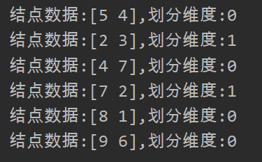
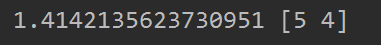

## K近邻法与kd树

### 一、k近邻算法

>输入：训练数据集
>$$
>T = \{(x_1,y_1),(x_2,y_2),...,(x_n,y_n)\}
>$$
>其中，$x_i \in R^n$ 为实例的特征向量，$y_i \in Y = {c_1,c_2,c_3,..,c_k}$为实例类别，$i=1,2,3,..N$,实例特征向量$x$.
>
>输出：实例特征向量所属的类
>
>(1) 根据给定的距离度量，在训练集$T$中找出与$x$最邻近的$k$个点，涵盖这$k$个点的$x$的邻域记作$N_k(x)$.
>
>(2) 在$N_k(x)$中根据分类决策规则(如多数表决)决定$x$的类别$y$。
>$$
>y = \mathop{argmax}_{c_j} \sum_{x_i\in N_k(x)} I(y_i=C_j)
>$$
>

k近邻算法没有显式的学习过程。

### 二、k近邻模型

k近邻模型由三个基本要素组成——距离度量，k值选择，分类决策规则

#### 2.1 距离度量

 闵可夫斯基距离公式：
$$
L_p(x_i,x_j) = (\sum_{l=1}^{n}|x_i^{(l)}-x_j^{(l)}|^p)^{\frac{1}{p}}
$$
当p = 2 时，公式称为欧式距离。

当p = 1时，公式称为曼哈顿距离。

当p = $\infin$时，它时各个坐标的最大值，即：$L_{\infin}(x_i,x_j) = \mathop{max}_l|x_i^{(l)} - x_j^{(l)}|$

####  2.2 k值的选择

k值选择越小，对噪声越敏感，越容易造成过拟合

#### 2.3 分类决策规则

一般采用多数表决规则(majority voting rule)

### 三、k近邻法的实现：kd树

但我们使用k近邻算法时，其中最耗时的就是对k近邻的搜索，当我们需要比较每一个训练数据点与所求样本之间的距离，如果是线性搜索，那么当特征空间的维数和训练数据量非常大时，这就变成了k近邻法的鸡肋了。

为了提高k近邻搜索的效率，我么可以考虑使用特殊的结构存储训练数据，以减少计算距离的次数。这里我们就要用到kd树的方法。（这里的k指的是k维空间）

#### 3.1 构造kd树

kd树是一种对k维空间中的实例点进行存储以便对其进行快速检索的树形数据结构，kd树是二叉树，表示对k维空间的一个划分。构造kd树相当于不断的用垂直于坐标轴的超平面将k维空间切分，构成一系列的k维超矩形空间。

构造kd树的算法如下：

> 输入：k维空间数据集$T={x_1,x_2,...,x_N}$其中$ x_i = (x_i^{(1)},x_i^{(2)},...,x_i^{(k)} )$
>
> 输出：kd树
>
> (1)开始：构造根结点，根结点对应于包含T的k维空间的超矩形区域。
>
> ​     选择$x^{(1)}$为坐标轴，以T中所有实例的$x^{(1)}$坐标的中位数为切分点，将根节点对应的超矩形区域切分为两个子区域。切分由通过切分点并与坐标轴$x^{(1)}$垂直的超平面实现。
>
> 由根结点生成深度为1的左右子结点：左子结点对应坐标$x^{(1)}$小于切分点的子区域，右子结点对应于坐标$x^{(1)}$大于切分点的子区域。
>
> (2) 重复：对深度为$j$ 的结点，选择$x^{(l)}$ ,$l=j(mod\ k)+1$ 以该结点的区域中所有实例的$x^{(l)}$的中位数为切分点，将该结点对应的超矩形区域切分为两个子区域。切分由通过切分点并与坐标轴垂直的超平面实现。
>
> 由根结点生成深度为$j+1$的左右子结点：左子结点对应坐标$x^{( l )}$小于切分点的子区域，右子结点对应于坐标$x^{(l)}$大于切分点的子区域。
>
> (3)直到两个子区域没有实例存在时停止，从而形成kd树的区域划分。

**代码(简化代码实现，只实现二维的)**

先对kd树和结点进行定义

```python
class KDT(object):
    def __init__(self):
        self.head = None


class KDTNode(object):
    def __init__(self, parent, value, axis):
        self.left = None
        self.right = None
        self.parent = parent
        self.value = value
        self.axis = axis
        self.isVisit = False  #搜索时记录是否被访问过
```

下面是kd树的构造过程和其用到的工具方法：

```python
def handleData(data, idx):
    '''
    将数据根据idx维度的中位数进行划分
    :param data: 要划分的数据
    :param idx:  在数据的哪个维度上进行划分
    :return: 作为划分结点的med ,左子树数据left,右子树数据right
    '''
    tmp = data[:, idx]
    medI = np.median(tmp)
    no = (np.abs(tmp - medI)).argmin()
    medI = data[no, idx]
    med = data[no]
    data = np.delete(data, no, axis=0)
    left = data[data[:, idx] < medI]
    right = data[data[:, idx] >= medI]
    return med, left, right

def builtNode(data, parent, idx):
    '''
    构造kd树的结点
    :param data: 输入的数据
    :param parent: 父节点
    :param idx: 在idx维度上进行划分
    :return:
    '''
    # 将数据分为idx维度上的中间节点，左部分，右部分
    med, left, right = handleData(data, idx)
    node = KDTNode(parent=parent, value=med, axis=idx)
    if (left.size != 0):
        node.left = builtNode(left, node, 1 - idx)
    if (right.size != 0):
        node.right = builtNode(right, node, 1 - idx)
    return node

def builtKDT(data):
    '''
    构造kd树
    :param data: 输入的数据
    :return: 
    '''
    kdt = KDT()
    kdt.root = builtNode(data, None, 0)
    return kdt

def printKDT(kdt):
    '''
    二叉树的先序输出
    :param kdt:
    :return:
    '''
    printNode(kdt.root)

def printNode(node):
    print('结点数据:{},划分维度:{}'.format(node.value, node.axis))
    if node.left != None:
        printNode(node.left)
    if node.right != None:
        printNode(node.right)
data = np.array([[2, 3], [5, 4], [9, 6], [4, 7], [8, 1], [7, 2]])
kdt = builtKDT(data2)
printKDT(kdt)
```

上述代码的结果截图如下：



#### 3.2  搜索kd树

下面介绍如何利用kd树进行最近邻搜索(k=1)：给定一个 目标点，首先找到代表目标点区域的叶节点，然后从该叶节点出发，依次回退到父节点，不断查找与目标节点最邻近的节点，当确定不可能存在更近的节点时终止。

> 输入：已构造的kd树，目标点x
>
> 输出： x的最近邻
>
> (1) 在kd树中找出包含目标点x区域的叶节点：从根节点出发，递归的向下访问kd数。在kd树的每层中，通过在划分依据的维度idx上进行比较，比当前访问节点小，就向左子树走，反之就向右子树走。
>
> (2) 以叶节点为“当前最近点”。
>
> (3) 递归地向上回退，在每个节点处进行以下操作：
>
> ​     (a)如果当前结点与目标结点的距离比已知的最邻近结点少，则将当前结点标记为最邻近节  
>
> ​          点。
>
> ​     (b) 检查当前结点的另一个子树是否有更接近的数据点。具体操作为：已目标点为圆心，以与最近邻点的距离为半径画圆，如果该圆与另一个子树所代表的区域相交，则在另一个子树上执行kd树的最近邻搜索。然后继续回退到父节点。
>
> (4) 当回退到根节点时，搜索结束。最终记录的最近邻点即为所求点。

```python
def findleaf(root, x):
    '''
    根据kd树,找到x对应的叶节点
    :param root: kd树的根节点
    :param x: 目标节点
    :return:  叶节点
    '''
    axis = root.axis
    leaf = root
    if (x[axis] < root.value[axis]) & (root.left != None):
        leaf = findleaf(root.left, x)
    if (x[axis] >= root.value[axis]) & (root.right != None):
        leaf = findleaf(root.right, x)
    return leaf


def nearstNeighborSearch(node, x, curDis, cur, searchSibling):
    '''
    递归的查找最近邻点
    :param node:
    :param x:
    :param curDis:
    :param cur:
    :param searchSibling:
    :return:
    '''
    if node.isVisit:
        return curDis, cur
    node.isVisit = True
    dis = np.sqrt(np.sum((node.value - x) ** 2))
    if dis < curDis:
        curDis = dis
        cur = node
    if (searchSibling == 1) & (node.left != None):
        tmpDis, tmp = nearstNeighbor(node.left, x, curDis=curDis, cur=cur)
        if tmpDis < curDis:
            curDis = tmpDis
            cur = tmp

    if (searchSibling == 2) & (node.right != None):
        tmpDis, tmp = nearstNeighbor(node.right, x, curDis=curDis, cur=cur)
        if tmpDis < curDis:
            curDis = tmpDis
            cur = tmp
    if node.parent != None:
        axis = node.parent.axis
        tmpDis, tmp = 0, None
        if (x[axis] < node.parent.value[axis]) & (node.parent.value[axis] - x[axis] < curDis):
            tmpDis, tmp = nearstNeighborSearch(node.parent, x, curDis, cur, 2)
        elif (x[axis] >= node.parent.value[axis]) & (x[axis] - node.parent.value[axis] < curDis):
            tmpDis, tmp = nearstNeighborSearch(node.parent, x, curDis, cur, 1)
        else:
            tmpDis, tmp = nearstNeighborSearch(node.parent, x, curDis, cur, 0)
        if tmpDis < curDis:
            curDis = tmpDis
            cur = tmp
    return curDis, cur


def nearstNeighbor(root, x, curDis=np.inf, cur=None):
    leaf = findleaf(root, x)
    curDis, cur = nearstNeighborSearch(leaf, x, curDis, cur, 0)
    return curDis, cur

data = np.array([[2, 3], [5, 4], [9, 6], [4, 7], [8, 1], [7, 2]])
kdt = builtKDT(data)
printKDT(kdt)
x = np.array([4, 5])
nearestDis, nearestNode = nearstNeighbor(kdt.root, x, curDis=np.inf, cur=None)
print(nearestDis, nearestNode.value) #输出最短距离 最近邻点
```

运行的结果如下：



如果实例点是随机分布的，kd树搜索的平均计算复杂度是$O(logN)$.

