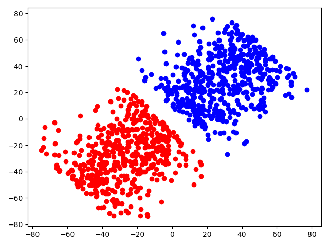
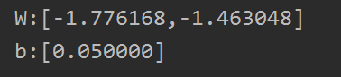
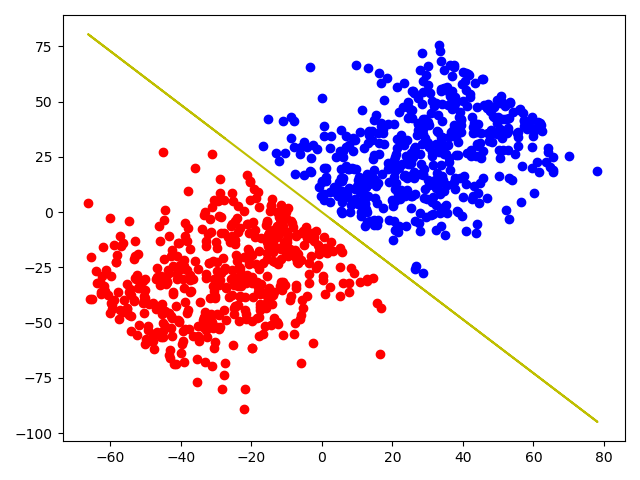

# 感知机

## 一、感知机模型

**定义（感知机）**：假设输入空间（特征空间）是 $\chi \subseteq\R^n$ ,输出空间是 $Y=\{+1,-1\}$ .输入$x\in\chi$ 表示实例的特征向量，对应于输入空间（特征空间）的点；输出$y\in Y$表示实例的类别，由输入空间到输出空间的的如下函数：
$$
f(x) = sign(w\bullet x+b)
$$
称为感知机。其中$w 和 b$  称为感知机模型参数，$w$称为权值向量(weight vectoer),$b$称为偏置(bias).$w\bullet x$为$w$和$x$的内积。$sign$是符号函数，形式如下：
$$
sign(x)=
\begin{equation}
\left\{
		\begin{array}{**lr**}
			+1  \\
			-1
		\end{array}
\right.
\end{equation}
$$
感知机是一种线性分类模型，属于判别模型。其几何意义就是在一组训练数据组成的集合中，通过$w,b$所确定的超平面将训练数据分为两类。$w$即为超平面的法向量，$b$为超平面的截距.寻找最优的$w$和$b$的过程就是感知机模型的训练。

## 二、感知机的学习策略

### 2.1 数据的线性可分性

**定义(数据集的线性可分性)** 给定一个数据集：
$$
T=\{(x_{1},y_{1}),(x_{2},y_{2}),...,(x_{n},y_{n})\}
$$
其中，$x_{i} \in \chi = R^n$ ,$y_{i} \in Y={+1,-1},i = 1,2,...,N$,如果存在某个超平面$w\bullet x+b=0$能够将所有的数据点正确分类，则称给定的数据集是线性可分的。

### 2.2 感知机的学习策略

我们首先定义感知机算法常用的损失函数：误分类的点到超平面$S$的距离之和
$$
\frac{1}{||w||}\sum|w \bullet x+b| \tag{1}
$$
对于误分类的点可知感知机得到的结果于真实的结果符号相反，
$$
-y_{i}(w \bullet x+b) = 0
$$
则(1)式可更改为：
$$
-\frac{1}{||w||}\sum y_{i}(w \bullet x+b) \tag{2}
$$
又因为$w和b$的值同时增大和减少对超平面没有任何影响，为了计算方方便我们把(2)式的分母去掉得到感知机模型的最终表达式：
$$
L(w,b) = -\sum_{x_{i}\in M} y_{i}(w \bullet x +b)
$$
M为所有误分类点的集合。

### 2.3 感知机的学习算法

感知机的学习算法是误分类点驱动的，通过给定的训练集，利用随机梯度下降(stochastic gradient) 进行模型参数的更新，优化整个感知机模型。

####  2.3.1 感知机算法的原始形式

> **算法1 (感知机算法的原始形式)**
> 输入：训练集 T，学习率 $\eta$$\in (0,1)$
>
> 输出：$w,b$;
>
> (1) 选取初值$w_{0},b_{0}$
>
> (2)在训练集中选取$(x_{i},y_{i})$
>
> (3)如果$y_{i}(w \cdot x_{i} + b)\le 0$,
> $$
> w\leftarrow w+\eta y_{i} x_{i} \\
> b\leftarrow w+\eta y_{i}
> $$
> (4)转至(2),直到训练集中没有误分类点。

下面我们通过代码构建一个简单的例子来实现感知机算法。

手动构建数据集：

```python
import numpy as np
import matplotlib.pyplot as plt
n = 1000 
X = np.random.randn(2, n) * 10
# Q = 2.5 * X[0] + 2 * X[1] + 2
X[1] = (2 - 2.5 * X[0]) / 2
pr = np.random.uniform(-5, 5, (1, n)) * 10
pr[pr > 0] = pr[pr > 0] + np.random.uniform(2, 5);
pr[pr < 0] = pr[pr < 0] - np.random.uniform(2, 5);
X = X - pr
Y = np.array(pr > 0, dtype=np.int)
plt.scatter(x=X[0][Y[0] > 0], y=X[1][Y[0] > 0], color='r')
plt.scatter(x=X[0][Y[0] <= 0], y=X[1][Y[0] <= 0], color='b')
```

 构建的数据集如下图所示：



 使用感知机算法，计算将数据点正确分割：

```python
lr = 0.05
w0 = np.random.randn()
w1 = np.random.randn()
b = 0

for i in range(n):
    if Y[0][i] * (w0 * X[0][i] + w1 * X[1][i] + 2) <= 0:
        w0 = w0 + lr * Y[0][i] * X[0][i]
        w1 = w1 + lr * Y[0][i] * X[1][i]
        b = b + lr * Y[0][i]
        i = 0
print("W:[%f,%f]" % (w0, w1))
print("b:[%f]" % b)
X_ = (b - w0 * X[0]) / w1
plt.plot(X[0],X_,color='y')
plt.show()

```

   最后得到的答案如下：



 



#### 2.3.1 算法的收敛性

  我们将$w,x$进行扩充$\hat{x} = (x^T,1)^T $ ,$\hat{w}=(w^T,b)^T$ .下面对Novikoff定理进行证明。

 **定理(Novikoff)** 设训练数据集$T=\{(x_{1},y_{1}),(x_{2},y_{2}),...,(x_{3},y_{3}\}$ 是线性可分的，其中$x_{i} \in \chi = R^n,y_{i}\in Y = \{+1,-1\}$ 则：

(1) 存在满足条件$|| \hat{w}_{opt} ||=1$ 的超平面 $\hat{w}_{opt} \cdot \hat{x}$ 将训练数据集完全正确分开，且存在 $\gamma$ >0,对所有的$i=1,2...,N$ 
$$
y_{i}(\hat{w_{opt}}\cdot \hat{x_i}) \ge \gamma
$$
(2) 令$R=\max_{1\le i\le N}||\hat{x_i}||$ 则感知机算法在训练集上的误分类次数k满足不等式：
$$
k \le (\frac{R}{\gamma})^2
$$
 **证明：**

(1) 第(1)部分很好理解，因为训练数据集是线性可分的，所以存在$\hat{w}$使得$y_{i}(\hat{w_{opt}\cdot x_i})\gt0$ 所以存在$\gamma=\min\{y_i(\hat{w_{opt}}\cdot x_i)\}$  使得$y_{i}(\hat{w_{opt}}\cdot \hat{x_i}) \ge \gamma$.

(2) 令$\hat{w_{k-1}}$是前$k-1$个误分类实例的扩充权重向量，若$(x_i,y_i)$是被$\hat{w_{k-1}}$ 误分类的数据，则$w,b$的更新是：
$$
w_k \leftarrow w_{k-1} + \eta y_ix_i \\
b_k \leftarrow b_{k-1} + \eta y_i
$$
  或者说是： $\hat{w_k}=\hat{w_{k-1}} + \eta y_i\hat{x_i} \tag{3}$

  由(3)得：
$$
\hat{w}_k \cdot \hat{w}_{opt} = \hat{w}_{k-1} \cdot \hat{w}_{opt} + \eta y_i\hat{x_i} \ge \hat{w}_{k-1} \cdot \hat{w}_{opt} + \eta\gamma \tag{4}
$$
(4)式子不断递推下去可以得到：
$$
\hat{w}_k \cdot \hat{w}_{opt} \ge k\eta\gamma \tag{5}
$$

$$
||\hat{w}_k||^2 = ||\hat{w}_{k-1}||^2 + 2\eta y_i\hat{w}_{k-1}\cdot \hat{x}_i + \eta^2||\hat{x}_i||^2\\
\le ||\hat{w}_{k-1}||^2 + \eta^2||\hat{x}_i||^2\\
\le ||\hat{x}_{k-1}||^2 + 2\eta^2R^2\\
\le k^2\eta^2R^2 \tag{6}
$$

结合(5)(6)可得：
$$
k\eta\gamma \le \hat{w}_k \cdot \hat{w}_{opt} \le ||\hat{w}_k|| ||\hat{w}_opt||\le \sqrt{k}\eta\gamma
$$
所以    $k\le(\frac{R}{\eta})^2$

上式表明错误分类的次数是由上界的，即总会存在一次更新得到的感知器模型使得所有的训练数据都能正确分类。

## 三、参考资料

统计学习方法(第二版)  李航